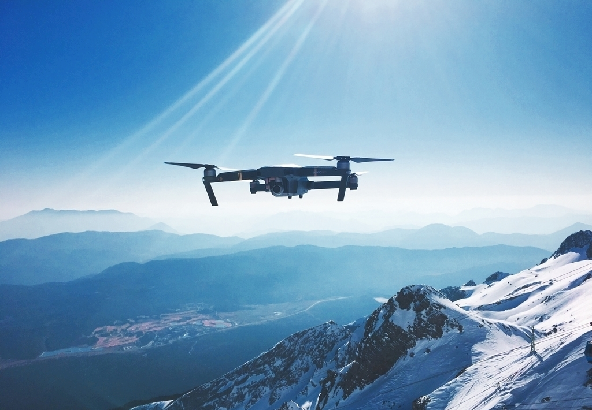

# 集美大学无人机科创实验室

**集美大学无人机实验室**成立于2020年，专注于研究、开发和无人机相关技术，致力于推动无人机领域的创新和发展。

我们由来自电子信息工程、通信工程、人工智能、微电子科学与工程等专业的同学和老师而组成，共同合作，进行无人机等涵盖无人机、机器人、视频编解码、深度学习等领域的研究和项目开发。

我们的主要目标之一是锻炼培养在无人机技术等相关领域的能力。实验室提供学生实践和研究的机会，通过参与无人机及机器人项目，获得实际操作和工程应用的经验。

历年来，我们积极参与各项学科竞赛及科学研究活动，获得若干国家级、省级奖项，成功发表若干SCI、EI论文，项目获得国家级、省级大创立项等。实验室成员毕业后多通过考研、推免升学至复旦大学、厦门大学、华东师范大学、西安电子科技大学等高校，或凭借丰富的工程经验和项目经历成功进入科技公司进行工作。

通过我们的共同努力和研究，在未来将继续前行，书写属于我们的青春华章。

-  **位置**: [集美大学克立楼106 - 107](https://ditu.amap.com/search?query=%E9%9B%86%E7%BE%8E%E5%A4%A7%E5%AD%A6%E5%85%8B%E7%AB%8B%E6%A5%BC&city=350200&geoobj=117.847238%7C24.312809%7C118.601881%7C24.687369&zoom=10.94)

# 关于本文档
本文档由实验室成员共同开发完善，作为实验室相关项目的开发经验分享和记录，供学弟学妹参考，希望学弟学妹能够在此基础上，传承创新，不断完善，探索属于自己的广阔天地。