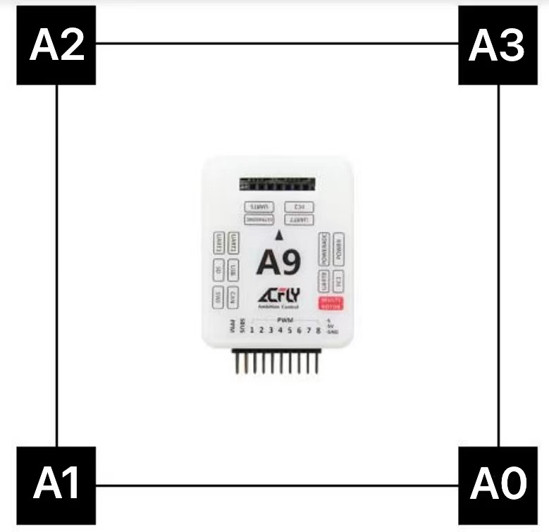
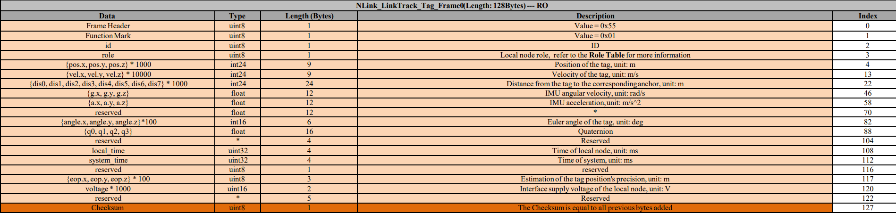

# UWB的使用
> Author: CGC


> 使用 Nooploop 的 LinkTrack 定位系统为 Acfly飞控提供定位
> 
> [官方资料](https://www.nooploop.com/download/)

## 配置
我们使用的是4基站+1标签+1控制台的方案

参考的是[官方用户手册](https://ftp.nooploop.com/software/products/uwb/doc/LinkTrack_User_Manual_V2.3_zh.pdf)中第13-14页的内容
> 1. 按顺序0-3的id分别配置4个anchor
> 2. 配置tag标签（飞控端） 通信协议选择tag_frame0
> 3. 配置console控制台

## 摆放及上电方向
> 由于飞控的数据适配性，基站摆放位置和飞机上电位置需要受到限制
> 
> （可能之后随着设备的更新会减轻这方面带来的影响，但是按我们目前的测试结果来看，还是非常建议按照已经测试好的方向进行初始化）

如下


## 飞控通信协议设置
### tag端通信协议
> 具体通信协议可以参考[官方参考通信协议](https://ftp.nooploop.com/software/products/uwb/doc/NLink_V1.4.pdf)
> 
> 在此处对飞控段使用的协议即 Tag 端作说明 即

tag端通信协议（接收）如下

可知飞控可接收到数据有位置、姿态、精度等一系列数据

### 官方驱动代码
以下给出acfly官方发布的驱动代码
```cpp
#include "drv_UWB_LinkTrack.hpp"
#include "Commulink.hpp"
#include "Basic.hpp"
#include "FreeRTOS.h"
#include "task.h"
#include "SensorsBackend.hpp"
#include "MeasurementSystem.hpp"

struct DriverInfo
{
	uint32_t param;
	Port port;
	uint32_t sensor_key;
};

typedef struct
{
	uint8_t id;
	uint8_t role;
	int pos_x:24;	int pos_y:24;	int pos_z:24;		
	int vel_x:24;	int vel_y:24;	int vel_z:24;	
	int dis_0:24;	int dis_1:24;	int dis_2:24;	int dis_3:24;	int dis_4:24;	int dis_5:24;	int dis_6:24;	int dis_7:24;
	float imuGyro[3];
	float imuAcc[3];
	uint8_t reserved1[12];
	int16_t angle[3];
	float q[4];
	uint8_t reserved2[4];
	uint32_t localTime;
	uint32_t systemTime;
	uint8_t reserved3[1];
	uint8_t eop[3]; // 估计位置的精度
	uint16_t voltage;
	uint8_t reserved4[5];
}__PACKED _Uwb;
static const unsigned char packet_ID[2] = { 0x55 , 0x01 };

static void OpticalFlow_Server(void* pvParameters)
{
	DriverInfo driver_info = *(DriverInfo*)pvParameters;
	delete (DriverInfo*)pvParameters;
	
	/*状态机*/
		_Uwb  Uwb;
		unsigned char rc_counter = 0;
		signed char sum = 0;
	/*状态机*/
	
	//等待初始化完成
	while( get_Altitude_MSStatus() != MS_Ready )
		os_delay(1);
	
	//注册传感器
	double angleOffset = 0;
	if( driver_info.param>360 )
	{
		//记录初始偏航
		Quaternion quat;
		get_Attitude_quat(&quat);
		angleOffset = quat.getYaw();
	}
	else
		angleOffset = degree2rad((double)driver_info.param);
	
	
	uint32_t sensor_key = PositionSlamSensorRegister( default_uwb_sensor_index , \
                                                    "UWB_LinkTrack" ,\
                                                    Position_Sensor_Type_RelativePositioning , \
                                                    Position_Sensor_DataType_s_xy , \
                                                    Position_Sensor_frame_SLAM , \
                                                    0.1, angleOffset, 100 );
	
	int lastP = 0;
	uint8_t pUCCounter = 0;
	while(1)
	{
		uint8_t rdata;
		if( driver_info.port.read( &rdata, 1, 2, 0.5 ) )
		{
			if( rc_counter < sizeof(packet_ID) )
			{
				//接收包头
				if( rdata != packet_ID[ rc_counter ] )
				{
					rc_counter = 0;
					sum = 0;
				}
				else
				{
					++rc_counter;
					sum += rdata;
				}
			}
			else if( rc_counter < sizeof(packet_ID) + sizeof(_Uwb) )
			{	//接收数据
				( (unsigned char*)&Uwb )[ rc_counter - sizeof(packet_ID) ] = rdata;
				sum += rdata;
				++rc_counter;
			}
			else
			{	//校验
				if( sum == rdata )
				{
					if( Uwb.eop[0]>200 || Uwb.eop[1]>200 ) // x y 精度大于2cm就失能
						PositionSensorSetInavailable(default_uwb_sensor_index,driver_info.sensor_key);
					else 
					{
						vector3<double> pos, vel;
						pos.x = Uwb.pos_x*0.1;
						pos.y = Uwb.pos_y*0.1;
						pos.z = Uwb.pos_z * 0.1;
						vel.x = Uwb.vel_x*0.01;
						vel.y = Uwb.vel_y*0.01;
						vel.z = Uwb.vel_z * 0.01;
						if( Uwb.eop[2] > 200 )
							PositionSensorChangeDataType( default_uwb_sensor_index,sensor_key, Position_Sensor_DataType_s_xy );
						else
							PositionSensorChangeDataType( default_uwb_sensor_index,sensor_key, Position_Sensor_DataType_s_xyz );
						double eop_xy = sqrtf( Uwb.eop[0]*Uwb.eop[0] + Uwb.eop[1]*Uwb.eop[1] );
						
						if( Uwb.dis_0 != lastP )
						{
							lastP = Uwb.dis_0;
							pUCCounter = 0;
						}
						else
						{
							if( pUCCounter < 255 )
								++pUCCounter;
						}
						
						if( pUCCounter>100 )
							PositionSensorSetInavailable( default_uwb_sensor_index,sensor_key );
						else
							PositionSensorUpdatePosition( default_uwb_sensor_index,sensor_key, pos, true, -1, eop_xy<100?100:eop_xy, Uwb.eop[2] );
					}
				}
				rc_counter = 0;
				sum = 0;
			}
		}
	}
}

static bool UWB_LinkTrack_DriverInit( Port port, uint32_t param )
{
	//波特率115200
	port.SetBaudRate( 460800, 2, 2 );
	//注册传感器
	DriverInfo* driver_info = new DriverInfo;
	driver_info->param = param;
	driver_info->port = port;
    
	xTaskCreate( OpticalFlow_Server, "OptFlowGL9306", 1024, (void*)driver_info, SysPriority_ExtSensor, NULL);
	return true;
}

void init_drv_UWB_LinkTrack()
{
	PortFunc_Register( 41, UWB_LinkTrack_DriverInit );
}
```
### 值得一提
在以上驱动代码中，值得一提的是
```cpp
// z 精度大于2cm就不使用z轴数据
if( Uwb.eop[2] > 200 ) 
    PositionSensorChangeDataType( default_uwb_sensor_index,sensor_key, Position_Sensor_DataType_s_xy );
else
    PositionSensorChangeDataType( default_uwb_sensor_index,sensor_key, Position_Sensor_DataType_s_xyz );
```
及
```cpp
if( Uwb.eop[0]>200 || Uwb.eop[1]>200 ) // x y 精度大于2cm就失能
    PositionSensorSetInavailable(default_uwb_sensor_index,driver_info.sensor_key);
else 
{
  // ...
}
```
> 驱动内容为 超出2cm的精度许可范围，就将传感器失能
> 
> **UWB官方给出的数据是，x y 的精度在 10cm 之内 z 精度在 30cm 以内**

- 关于z轴数据

这样一来其实可以反应我们看到的现象，首先是在只使用uwb作为外接传感器时，飞机完全定不住高（因为z精度完全无法满足2cm的要求），但是可能由于飞控中气压计等设备的存在，飞控有高度数据，室内定位可用，所以能够允许起飞，但在天上的高度数据，完全由飞控而来，所以现象是，没有定高可言。。。


## 注意事项及传感器使用建议
1. 使用时发起自动标定的设备需要在线，比如我们使用控制台发起一键标定，则在使用时控制台必须要在线，否则数据会不可用
2. 由于uwb的z轴精度较低，建议加上tfmini等作为定高传感器，通过测试，有uwb加上tfmini，定位效果较好

## 写在最后
- 通过这段时间的测试，我们发现至少在电赛赛制的背景下，用uwb可能会出现某些限制，比如场地不一定能够容纳摆放下基站，并且无法在换场地后进行标定，可能受到干扰等
- 对于电赛（赛场不允许携带笔记本及pc，上位机只支持x86，我们手上已有的板载电脑皆为arm，无法在现场进行标定）无法在换场地后进行标定的情况，可能考虑自行写接口，使用单片机或板载电脑进行标定，能够很大程度减少对位置场地的限制，我们尝试按照通信协议写了一份一键[自动标定的程序](https://github.com/CGC12123/LinkTrack-Uwb-OneclickCalibration-STM32)，但还未在实际场地中进行测试。